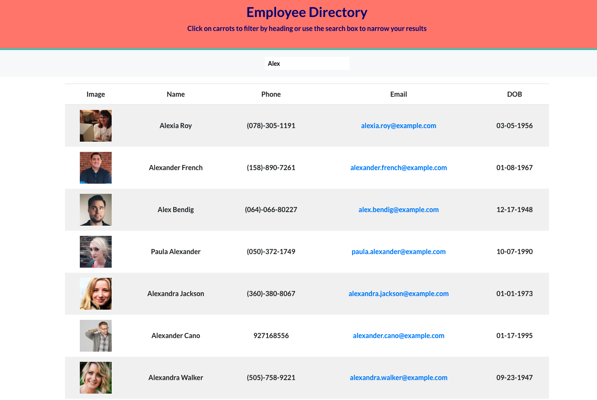
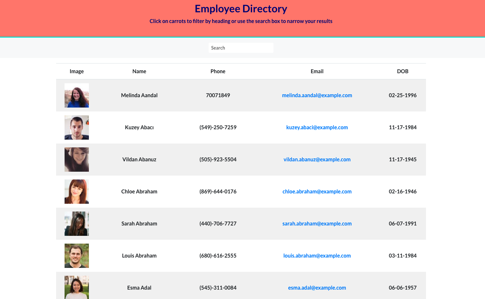
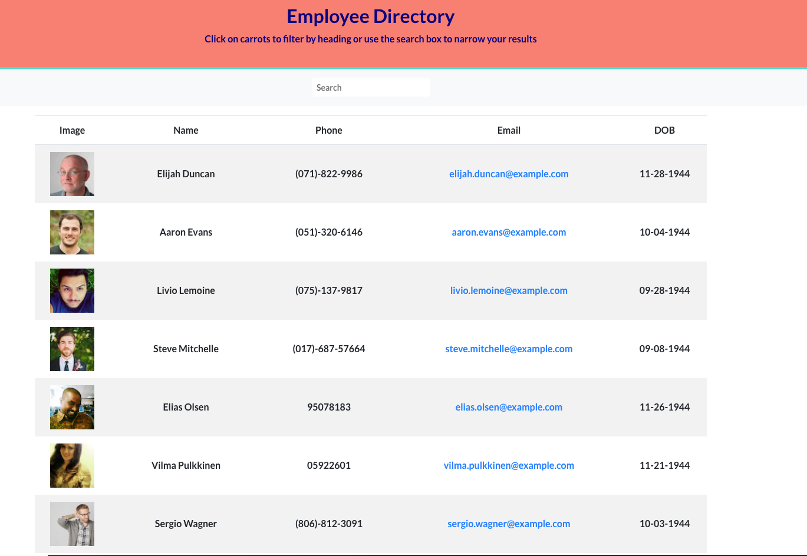

# Employee Directory

## Description

I built this react app so that an employer could see all their employee's images, names, phone numbers, emails and birth dates listed on one page. By typing in the search bar, the user can filter employees by first name or last name. If the user clicks on the "Name" tab the employees list will be alphabetized by last name. If the user clicks the "DOB" tab the employees list will be sorted by year. While working on this project I furthered my knowledge in the basics of React such as, passing props to components, writing class components vs function components, conditional rendering and utilizing the "sort" and "map" array methods.

## Usage

All you have to do is go to the deployed application [HERE](https://petermodavis.github.io/employee-directory/)
Once at the at the application you can search in the searchbar by first or last name:

You can click on the Name tag and they employees will be alphabetized by last name:

And you can click on the DOB and employees will be sorted by year from oldest to youngest.

## Contributing

--[React](https://reactjs.org/) 
--[Axios](https://www.npmjs.com/package/axios) 
--[Bootstrap](https://getbootstrap.com/)

## Questions

For any additional questions I can be reached at  [GitHub](https://github.com/PeterMoDavis)  pmodavis.webdev@gmail.com

## License

MIT License

    Copyright (c) [year] [fullname]

    Permission is hereby granted, free of charge, to any person obtaining a copy
    of this software and associated documentation files (the "Software"), to deal
    in the Software without restriction, including without limitation the rights
    to use, copy, modify, merge, publish, distribute, sublicense, and/or sell
    copies of the Software, and to permit persons to whom the Software is
    furnished to do so, subject to the following conditions:

    The above copyright notice and this permission notice shall be included in all
    copies or substantial portions of the Software.

    THE SOFTWARE IS PROVIDED "AS IS", WITHOUT WARRANTY OF ANY KIND, EXPRESS OR
    IMPLIED, INCLUDING BUT NOT LIMITED TO THE WARRANTIES OF MERCHANTABILITY,
    FITNESS FOR A PARTICULAR PURPOSE AND NONINFRINGEMENT. IN NO EVENT SHALL THE
    AUTHORS OR COPYRIGHT HOLDERS BE LIABLE FOR ANY CLAIM, DAMAGES OR OTHER
    LIABILITY, WHETHER IN AN ACTION OF CONTRACT, TORT OR OTHERWISE, ARISING FROM,
    OUT OF OR IN CONNECTION WITH THE SOFTWARE OR THE USE OR OTHER DEALINGS IN THE
    SOFTWARE.

## Badges

